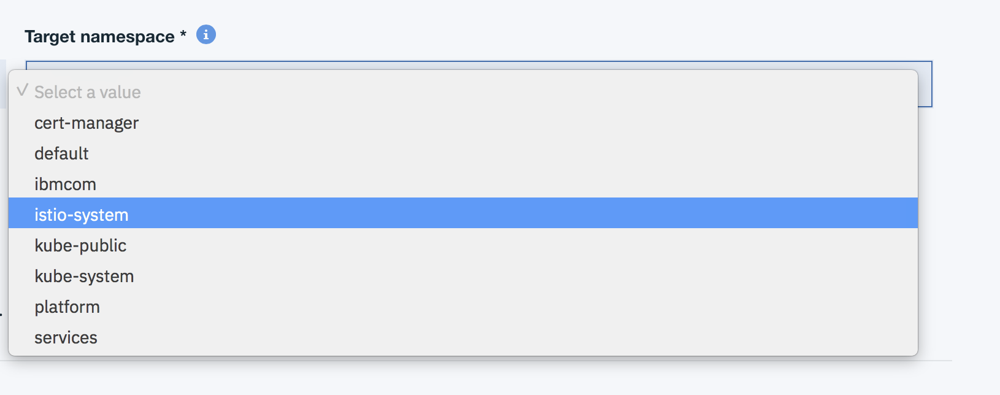

#  ICP-Airways
<h1 align="center">
  <br>
      Air-Line ticketing and booking application on IBM Cloud Private 
  <br>
  <br>
</h1>

<h4 align="center">Powered by IBM Cloud Private</h4>

<p align="center">
  <a>
    
  </a>
</p>
<br>

# Building an Airline Booking Application based on Microservices Architecture on IBM Cloud Private
### Introduction

In this Code Pattern, we will build a cloud native application based on microservice architecture, IBM Middlewares and following 12 factor practices. This application is an Airline Booking app, and the technologies behind this app are:- 
* Nodejs (Typescript)
* IBM DB2
* IBM ODM
* RabbitMQ
* MariaDB
* MongoDB
* Here Map
* Celery
* Angular
* Docker
* Kubernetes 
* IBM Cloud Private
* Istio
* Calico

Cloud native application is a buzzword these days. Technologies like Kubernetes and Docker are picking up reputation and popularity in Cloud native world. This Pattern will show an end to end process of building highly available Cloud Native Application on IBM Cloud Private. The Application backend is based on Nodejs and DB2, MariaDB, and MongoDB as a Database. The frontend is built using Angular4. Distributed Asynchronous task queue is based on RabbitMQ and Celery. Container orchestration is managed by Kubernetes.

### Learning objectives
When you've completed this Code Pattern, you will understand how to:

* Break the application into different microservices
* Deploying microservices based application on IBM Cloud Private
* Leveraging IBM Middlewares such as ODM and DB2 on Kubernetes
* Using Istio to build service mesh
* Using Grafana, Prometheus, kiali, and Weavnet for visualisation 
* Securing kubernetes networking through Calico
* Designing business rules and decision by IBM ODM
* Create distributed task ques using RabbitMQ and Celery
* Leveraging DB2, MariaDB, and MongoDB as backend data storage
* Learn how to use IBM Cloud Private, Docker, and Kubernetes
* Leveraging Heremap to fetch nearby landmarks

### App Screenshot

  

#### Flow
0. *Mobile App*:- End user mobile app who will access the application. It leverages restful endpoints by backend microservices
1. *Portal*:- The user interface is built using Angular4. It leverages restful endpoints by backend microservices
2. *Authentication Microservice*:- This Microservice allows the user to login signup to the application 
3. *Listing Microservice*:- This Microservice allows the user to list and browse the available flights
4. *Booking Microservice*:- This Microservice allows the user to checkin to a given booked flight, and book an available flight
5. *ODM Microservice*:- This Microservice helps to communicate with the ODM Service
6. *Email Microservice*:- Email Microservice communicates with RabbitMQ and Celery to send email in asynchronous ques
7. *Map Microservice*:- Map Microservice communicates with Here Map api to fetch nearby landmarks
8. *IBM DB2*:- SQL Database for authentication microservice
9. *MongoDB*:- NOSQL Database for listing microservice
10. *MariaDB*:- NOSQL Database for booking microservice
11. *ODM*:- IBM Operational Decision Manager is an advanced business rules management system that helps you capture, automate and govern frequent, repeatable business decisions and adds real-time decision making to your day-to-day operations
12. *RabbitMQ*:- RabbitMQ is a messaging broker - an intermediary for messaging. It gives your applications a common platform to send and receive messages, and your messages a safe place to live until received.
13. *Here Map*:- Here map api to fetch nearby locations

 

 #### Featured technologies
1. [Angular](https://angular.io/):- Angular is a platform that makes it easy to build applications with the web. Angular combines declarative templates, dependency injection, end to end tooling, and integrated best practices to solve development challenges
2. [Nodejs](https://nodejs.org/en/):- An open-source JavaScript run-time environment for executing server-side JavaScript code.
3. [Typescript](https://www.typescriptlang.org/):- TypeScript is an open-source programming language developed and maintained by Microsoft. It is a strict syntactical superset of JavaScript, and adds optional static typing to the language
4. [Docker](https://www.docker.com/):- Docker is an open platform for developers and sysadmins to build, ship, and run distributed applications, whether on laptops, data center VMs, or the cloud.
5. [Kubernetes](https://kubernetes.io/):- Kubernetes is an open-source system for automating deployment, scaling, and management of containerized applications
6. [IBM DB2](https://www.ibm.com/analytics/us/en/db2/):- DB2 is a database product from IBM. It is a Relational Database Management System (RDBMS)
7. [IBM ODM](https://www.ibm.com/ae-en/marketplace/operational-decision-manager):- IBM® Operational Decision Manager is a comprehensive decision automation platform that helps you capture, analyze, automate and govern rules-based business decisions
8. [RabbitMQ](https://www.rabbitmq.com/):- RabbitMQ is lightweight and easy to deploy on premises and in the cloud. It supports multiple messaging protocols. RabbitMQ can be deployed in distributed and federated configurations to meet high-scale, high-availability requirements
9. [Celery](http://www.celeryproject.org/):- Celery is an asynchronous task queue/job queue based on distributed message passing.	It is focused on real-time operation, but supports scheduling as well
10. [Ionic Cross Platform Mobile App](https://ionicframework.com):- Ionic’s open source Framework and developer-friendly tools and services power apps for some of the world’s best-known brands - from highly successful consumer apps like Sworkit, Untappd and Dow Jones MarketWatch, to mission-critical apps supporting Nationwide, Amtrak, and NASA.
11. [MongoDB](https://www.mongodb.com):- MongoDB is a cross-platform document-oriented database program. It is issued under the Server Side Public License version 1, which was submitted for certification to the Open Source Initiative but later withdrawn in lieu of SSPL version 2
12. [MariaDB](https://mariadb.com):- MariaDB is a community-developed fork of the MySQL relational database management system intended to remain free under the GNU GPL. Development is led by some of the original developers of MySQL
13. [Istio](https://istio.io):- Istio is an open source independent service mesh that provides the fundamentals you need to successfully run a distributed microservice architecture
14. [Weavenet](https://www.weave.works):- visualising kubernetes cluster


# Watch the Video

If you want a quick walkthrough of the end result, a video is available [here](https://ibm.box.com/s/0qe3jrduqthqyeadaa4jlu6qwfysbtn6)

## Deploy to IBM Cloud Private

### Pre-req installation 
1. Install [Nodejs](https://nodejs.org/en/download/)
2. Install [Kubectl](https://kubernetes.io/docs/tasks/tools/install-kubectl/)
3. Intall [Docker](https://docs.docker.com/install/)
4. Install [Angular4Cli](https://cli.angular.io)
5. Install [Ionic](https://ionicframework.com)

### Connect Docker (Private registery) with IBM Cloud Private
1. From your terminal type
```
$ sudo nano /etc/hosts
```


2. Type in your ICP ip and provide a dns name, quit and save the file
3. Go to Docker prefernces


4. Navigate to Daemon tab, click on + button and add an entry “icpdns:85000”, click Apply & Restart button to restart Docker service. 


5. In your terminal type
```
$ docker login icpdns:8500
```
### Install all dependencies, create images and upload it to Private registery of IBM Cloud Private
1. Booking Microservice
```s
$ cd booking-microservice
$ npm i
$ docker build -t booking-microservice:0.0.1 --no-cache .
$ docker tag booking-microservice:0.0.1 <icpdns>:8500/default/booking-microservice:0.0.1
$ docker push <icpdns>:8500/default/booking-microservice:0.0.1
```
2. Listing Microservice
```s
$ cd listing-microservice
$ npm i
$ docker build -t listing-microservice:0.0.1 --no-cache .
$ docker tag listing-microservice:0.0.1 <icpdns>:8500/default/listing-microservice:0.0.1
$ docker push <icpdns>:8500/default/listing-microservice:0.0.1
```
3. Authentication Microservice
```s
$ cd login-microservice
$ npm i
$ docker build -t login-microservice:0.0.1 --no-cache .
$ docker tag login-microservice:0.0.1 <icpdns>:8500/default/login-microservice:0.0.1
$ docker push <icpdns>:8500/default/login-microservice:0.0.1
```
4. Email Microservice
```s
$ cd celery
$ docker build -t celery:0.0.1 --no-cache .
$ docker tag celery:0.0.1 <icpdns>:8500/default/celery:0.0.1
$ docker push <icpdns>:8500/default/celery:0.0.1
```

5. Odm Microservice
```s
$ cd odm-microservice
$ npm i
$ docker build -t odm-microservice:0.0.1 --no-cache .
$ docker tag odm-microservice:0.0.1 <icpdns>:8500/default/odm-microservice:0.0.1
$ docker push <icpdns>:8500/default/odm-microservice:0.0.1
```

6. Angular Frontend
> under src/app/provider/provider.ts. Find url and change it to your icp ip
```s
$ cd icp-frontend-new
$ npm i
$ docker build -t angular:0.0.1 --no-cache .
$ docker tag angular:0.0.1 <icpdns>:8500/default/angular:0.0.1
$ docker push <icpdns>:8500/default/angular:0.0.1
```

7. Ionic Frontend
> under src/app/provider/provider.ts. Find url and change it to your icp ip
```s
$ cd icp-mobile
$ npm i
$ docker build -t ionic:0.0.1 --no-cache .
$ docker tag ionic <icpdns>:8500/default/ionic:0.0.1
$ docker push <icpdns>:8500/default/ionic:0.0.1
```

8. Map Microservice
```s
$ cd map-microservice
$ npm i
$ docker build -t map:0.0.1 --no-cache .
$ docker tag map:0.0.1 <icpdns>:8500/default/map:0.0.1
$ docker push <icpdns>:8500/default/map:0.0.1
```
> Find all your images in ```https://icpip:8443/console/manage/images``` 


### Connect kubesctl with IBM Cloud Private Kubernetes
1. Login to your icp instance by going to ```https://icpip:8443```
2. Click on configure, click on copy, and paste all these commands in your terminal


### Configuring Persistance storage in IBM Cloud Private for (DB2, MariaDB, MongoDB, RabbitMQ, and ODM)
1. Login to IBM Cloud Private by going to this link ``` https://icplink:8443 ```


2. Click on ```Platform``` and choose ```Storage```, then click on ``` Create PersistentVolume```


3. Provide the name ```shared``` for persistance volume
4. Provide storage capacity for around ```5GB```
5. Access mode change to ``` Read Write Many ```
6. Storage type to ``` HostPath ```
7. Click on parameters tab and add the follow parameters
```
path: /anypath
```
8. Click on create

> Create Persistant volume using the steps above for
* DB2
* MariaDB
* MongoDB
* RabbitMQ
* ODM 

### Deploy Istio
1. Go to ```Catalog``` and filter ```istio```


2. Choose target namespace as istio-system



> Enable Grafana

> Enable Prometheus

> Enable Servicegraph

> Enable Tracing

> Enable Kiali

3. Click on Install
4. Navigate to ```icp-backend/configMaps-secrets-istio-calico/kiali``` and run
```
$ kubectl apply -f secret.yaml
```
4. Check if Istio isd installed properly
```sh
$ kubectl get pods -n istio-system
```


### Deploying DB2
1. Go to ```Catalog``` and filter ```db2```


2. Click on configure, fil up the required field and deploy
3. Follow this [tutorial](https://developer.ibm.com/recipes/tutorials/deploy-db2-into-ibm-cloud-private/) to deploy db2 in IBM Cloud Private
> Make sure your Table name is "Sample"

> Make sure your username and password is "admin"

> Deploy as clusterip

### Database creation and configuration of DB2
1. ssh to db2 pod
```
$ kubectl exec -it <podname> bash
```
2. switch the user you have created
```
$ su - <username>
```
3. Connect to SAMPLE db
```s
$ db2 connect to SAMPLE
```
4. Create UserData table to store user information
* User Table
```SQL
db2 CREATE TABLE "SAMPLE.UserData (UserID int NOT NULL GENERATED ALWAYS AS IDENTITY (START WITH 1 INCREMENT BY 1) , LastName varchar(255) NULL , FirstName varchar(255) NULL, Location varchar(255) NULL, Email varchar(255) NULL,  Password varchar(255) NULL, Age int NULL, Tier varchar(255) NULL, PRIMARY KEY (UserID))"
```
### Deploying MariaDB
1. Go to ```Catalog``` and filter ```mariadb```
2. Click on configure, fil up the required field and deploy
> Make sure your Table name is "Sample"

> Make sure your username and password is "admin"

> deploy as ClusterIP

### Database creation and configuration of MariaDB
1. ssh to mariadb pod
```
$ kubectl exec -it <podname> bash
```
2. Get in to mysql cli
```
$ mysql
```
3. Connect to SAMPLE db
```s
$ use SAMPLE
```
8. Create Booking Table
* Booking Table
```SQL
CREATE TABLE SAMPLE.Booking (BookingID  MEDIUMINT NOT NULL AUTO_INCREMENT,TS TIMESTAMP DEFAULT CURRENT_TIMESTAMP NOT NULL , Checkin varchar(255) NOT NULL, OfferNamePricing varchar(255) NOT NULL, OfferTypePricing varchar(255) NOT NULL , CostPricing varchar(255) NOT NULL, OfferNameUpgrade varchar(255) NOT NULL, OfferTypeUpgrade varchar(255) NOT NULL , CostNameUpgrade varchar(255) NOT NULL,  UserID INT NOT NULL, FlightID varchar(255) NOT NULL , PRIMARY KEY (BookingID));
```
### Deploying MongoDB
1. Go to ```Catalog``` and filter ```mongodb```


2. Click on configure, fill up the required field and deploy

> Make sure your username and password is "admin"

> deploy as ClusterIP

### Deploying RabbitMQ 
1. Go to ```Catalog``` and filter ```rabbitmq```
2. Select ```RabbitMQ```, Click ``` Configure```, fill the form and click on deploy
> use clusterip

### Deploying ODM
1. Go to ```Catalog``` and filter ```odm```
2. Select ```odm```, Click ``` Configure```, fill the form and click on deploy

### Configuring ODM and loading buisness rules
1. Go to ``` http://icpip:odmport/teamserver/faces/login.jsp```, and login with *username*:- ```rtsAdmin```, and pass ```rtsAdmin```


2. Click on ```Configure``` tab, then click on ```import project```. Select the zip file under ```odm-microservice``` folder


3. Go to ``` http://icpip:odmport/decisioncenter/t/library```, and login with *username*:- ```rtsAdmin```, and pass ```rtsAdmin```
4. Select ```New Release``` from ```ICPAirlines-Rules```, then select ```ICPAirlinesDeployment``` and click ```deploy```


### Configuring and deploying secrets

1. *UID* is ur database username
2. *PASSWORD* is your database password
3. *UIDMARIADB* is your mariadb username
4. *PASSWORDMARIADB* is your mariadb password
5. *MONGOUSERNAME* is your mongodb username
6. *MONGOPASSWORD* is your mongodb password
7. *SECRET* is your unique secret you give for your app for jwt authentication
8. *EMAILUSERNAME* is your gmail email username from which email would be sent
9. *EMAILPASSWORD* is your email password of your gmail email
10. Navigate to ```secrets``` folder in ```configMaps-secrets/secrets```
11. Deploy secrets to kubernetes, navigate to folder icp-backend/configMaps-secrets-istio-calico/secrets
```
$ kubectl create -f secrets.yml
```
8. If you need to redeploy with certain changes
```
$ kubectl apply -f secrets.yml
```
> NOTE:- all these are base64 represenation encoding. 
```
$ echo -n 'admin' | base64
YWRtaW4=
```
### Configuring and deploying config-maps
1. *DATABASE*:- is your database name, which should be SAMPLE
2. *PORT*:- is your exposed db2 port from port 5000, get this port by running and finding db2 service
3. *HOSTNAME*:- is your db2 service name of db2
4. *ODM*:- is your ODM api, replace dns with your service name of odm 
5. *CELERY_RESULT_BACKEND*:- replace dns with ur rabbitmq service name
6. *HOSTNAMEMARIADB*:- replace with mariadb servicename
7. *HOSTNAMEMONGODB*:- replace with mongodb servicename
8. *APPID*:-  your here map appid
9. *APPCODE*:- your here map appcode

### Deploying microservices through helm
1. Booking Microservice
```s
$ cd booking-microservice/chart
$ helm install ./booking-microservice-0.1.0.tgz --name="bookingsvc" --tls
```
2. Listing Microservice
```s
$ cd listing-microservice/chart
$ helm install ./listing-microservice-0.1.0.tgz --name="listingsvc" --tls
```
3. Authentication Microservice
```s
$ cd login-microservice/chart
$ helm install ./login-microservice-0.1.0.tgz --name="loginsvc" --tls
```

4. Celery Microservice
```s
$ cd celery/chart
$ helm install ./celery-0.1.0.tgz --name="celerysvc" --tls
```

5. Odm Microservice
```s
$ cd odm-microservice/chart
$ helm install ./odm-microservice-0.1.0.tgz --name="odmsvc" --tls
```

6. Map Microservice
```s
$ cd map-microservice/chart
$ helm install ./map-microservice-0.1.0.tgz --name="mapsvc" --tls
```

7. Angular Frontend
```s
$ cd icp-frontend-new/chart
$ helm install ./angular-microservice-0.1.0.tgz --name="angular" --tls
```

8. Ionic Frontend
```s
$ cd icp-mobile/chart
$ helm install ./ionic-microservice-0.1.0.tgz --name="ionic" --tls
```

### Cross Platform Mobile App
* Make sure you have installed ionic and cordova
```
$ npm i -g ionic cordova
```
* For IOS, make sure you have installed XCODE. For Android, make sure you have installed Android Studio.
* For IOS, run 
```
$ ionic cordova prepare ios
```
* For Android, run
```
$ ionic cordova prepare android 
```

### Enable Istio-Gateway and Virtual Services
1. Navigate to ``` icp-backend/configMaps-secrets-istio-calico ```
2. kubectl apply -f istio/

### Microservices available 
* [x] Booking Microservice [:31380/bookingsvc/]
* [x] Listing Microservice [:31380/listingsvc/]
* [x] Authentication Microservice [:31380/loginsvc/]
* [x] Angular Frontend [:31380/icpairways/]
* [x] Celery Microservice [:31380/emailsvc/]
* [x] Odm Microservice [:31380/odmsvc/]
* [x] Map Microservice [:31380/mapsvc/]

# Docs
Documentation of all the backend endpoints is available [here](apidocs/README.md)